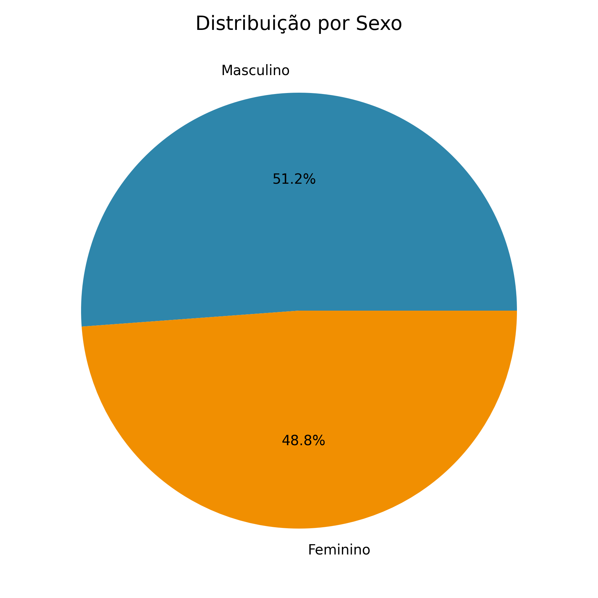
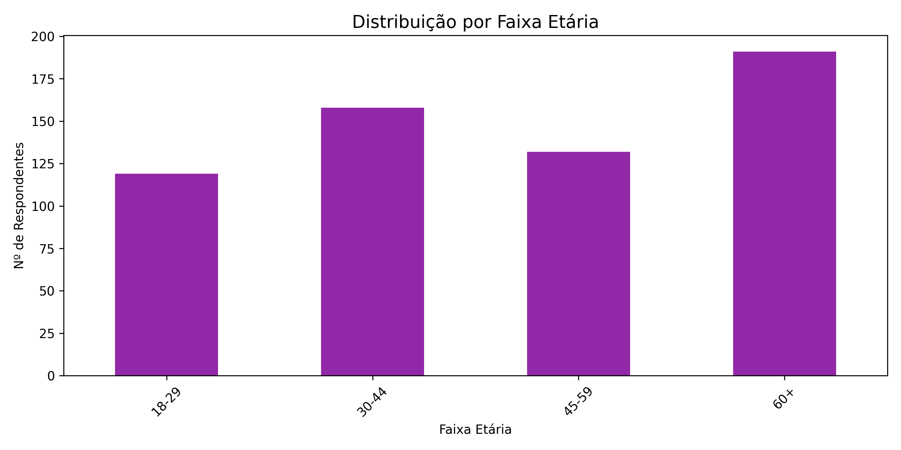
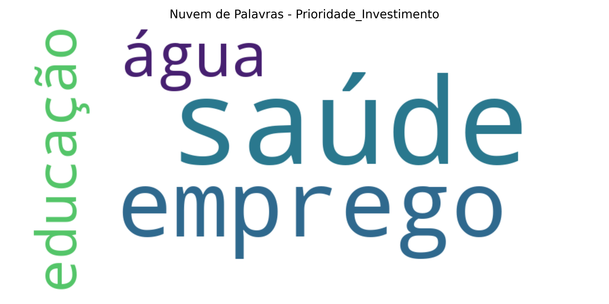
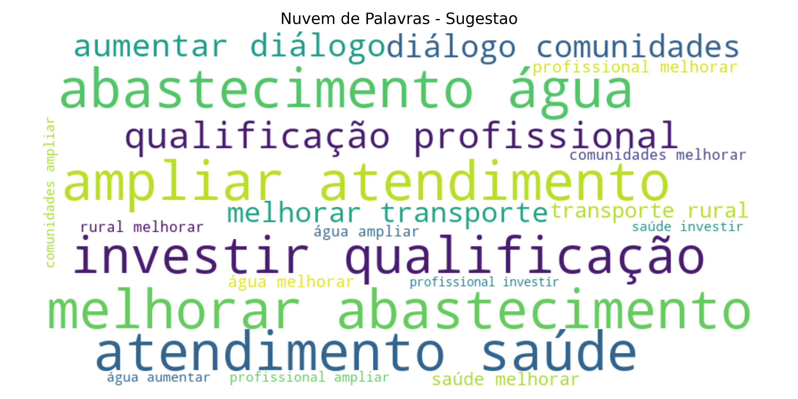
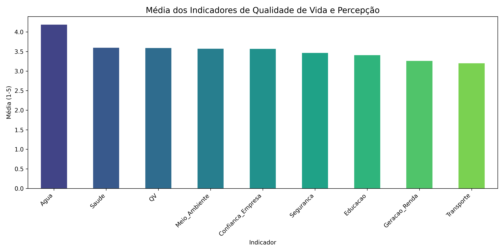
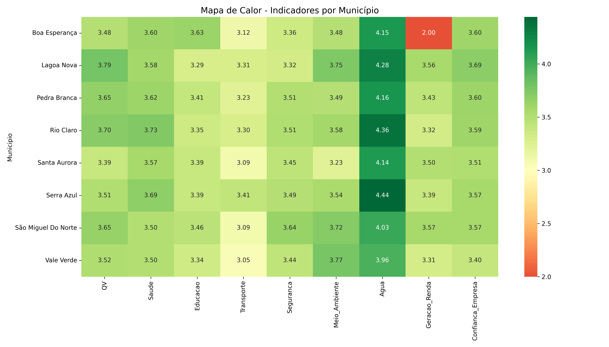
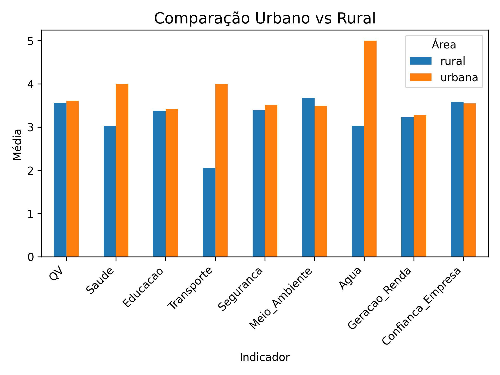

# Relatório de Insights – Diagnóstico Socioambiental

**Data de geração:** 2026-07-23 14:53

**Cargo:** Analista de Inteligência em Pesquisa Sênior

**Responsável:** [Joyce Emília O. Mota]

---

## 1. Resumo Executivo

O survey contou com **600 respondentes** distribuídos por **8 municípios**. Os dados revelam percepções importantes sobre Qualidade de Vida (QV), confiança em instituições e prioridades da população.

**Principais destaques:**
- A Qualidade de vida média (QV) é **3.59** (escala 1-5).
- Confiança na empresa: **3.57**
- Confiança no poder público: **3.46**

---

## 2. Perfil dos Respondentes

### 2.1. Distribuição Demográfica

- **Sexo:** {'M': 307, 'F': 293}
- **Faixa etária:** {'60+': 191, '30-44': 158, '45-59': 132, '18-29': 119}
- **Escolaridade:** {'Superior': 219, 'Médio': 196, 'Fundamental': 185}
- **Ocupação:** {'Desempregado': 128, 'Autônomo': 124, 'Agricultura': 122, 'Formal': 116, 'Aposentado': 110}
- **Renda média:** R$ 2575.78

---

## 3. Análise Qualitativa 

### 3.1. Principal_Preocupacao

- **Responderam:** 600 | **Não responderam:** 0
- **Principais palavras-chave:** água (248), saúde (129), emprego (114), segurança (109)

### 3.2. Prioridade_Investimento

- **Responderam:** 600 | **Não responderam:** 0
- **Principais palavras-chave:** saúde (323), emprego (175), água (56), educação (46)

### 3.3. Sugestao

- **Responderam:** 600 | **Não responderam:** 0
- **Principais palavras-chave:** melhorar (232), abastecimento (138), água (138), ampliar (137), atendimento (137)

---

## 4. Indicadores de Qualidade de Vida e Percepção

### 4.1. Médias Gerais

### 4.2. Por Município (Mapa de Calor)

### 4.3. Comparação Região Urbana vs Rural

---

## 5. Percepções por Município

### 5.1. Rio Claro

- **Total de respondentes:** 74
- **Principais preocupações:** água (25), saúde (19), emprego (17)
- **QV média:** 3.70

### 5.2. Pedra Branca

- **Total de respondentes:** 81
- **Principais preocupações:** água (34), saúde (17), segurança (16)
- **QV média:** 3.65

### 5.3. Boa Esperança

- **Total de respondentes:** 75
- **Principais preocupações:** água (33), saúde (19), emprego (12)
- **QV média:** 3.48

### 5.4. Lagoa Nova

- **Total de respondentes:** 72
- **Principais preocupações:** água (27), segurança (17), saúde (15)
- **QV média:** 3.79

### 5.5. Santa Aurora

- **Total de respondentes:** 74
- **Principais preocupações:** água (33), emprego (14), segurança (14)
- **QV média:** 3.39

### 5.6. São Miguel Do Norte

- **Total de respondentes:** 74
- **Principais preocupações:** água (35), emprego (16), saúde (12)
- **QV média:** 3.65

### 5.7. Vale Verde

- **Total de respondentes:** 80
- **Principais preocupações:** água (40), emprego (14), saúde (14)
- **QV média:** 3.52

### 5.8. Serra Azul

- **Total de respondentes:** 70
- **Principais preocupações:** água (21), saúde (20), segurança (15)
- **QV média:** 3.51

---

## 6. Recomendações Estratégicas

1. **Fortalecer a confiança institucional:** A confiança na empresa e no poder público é um ponto crítico. Recomenda-se ampliar canais de diálogo e transparência.
2. **Priorizar ações em áreas rurais:** Os indicadores de água, saúde e infraestrutura são menores nas áreas rurais. Investimentos específicos são urgentes.
3. **Focar em geração de renda e educação:** Os campos abertos indicam que essas são as principais preocupações. Programas de qualificação e emprego devem ser priorizados.
4. **Manter escuta ativa:** As sugestões qualitativas revelam oportunidades de melhoria que devem ser incorporadas ao planejamento.

---

*Relatório gerado automaticamente em 2026-07-23 14:53.*
